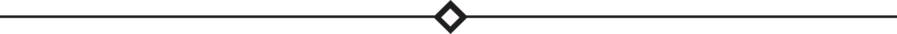

  

### Hi there, Welcome! 
#### About Me
I am a 6th-semester Data Science student at Institute of Informatics and Business Darmajaya. Focused on developing intelligent AI solutions, I have a deep interest in Machine Learning and Computer Vision to solve real-world problems through data-driven insights.

  

#### Things I Code With

  
  
  

  
  
  

  
  
  

#### I'm Learning

    
    

  

#### Pinned Repositories
Here are some of my featured projects in the fields of Machine Learning & Computer Vision:

<table style="width: 100%; border-collapse: collapse; font-size:14px;">
  <thead>
    <tr style="background-color: #6886FF;">
      <th style="width: 40%; text-align: left; padding: 10px; color: white;">Project Name</th>
      <th style="width: 50%; text-align: left; padding: 10px; color: white;">Tech Stack</th>
      <th style="width: 20%; text-align: center; padding: 10px; color: white;">Action</th>
    </tr>
  </thead>
  <tbody>
    <tr>
      <td style="padding: 10px;"><b>Automotive Sales Forecasting using Weighted Ensemble Model</b></td>
      <td style="padding: 10px;">
        

          
          
          
        

      </td>
      <td style="padding: 10px; text-align: center;"><a href="https://github.com/RezkyAdytama/Automotive-Sales-Forecasting-using-Weighted-Ensemble-Model">View Repo</a></td>
    </tr>
    <tr>
      <td style="padding: 10px;"><b>Real-time Classroom Attendance System using Face Recognition</b></td>
      <td style="padding: 10px;">
        

          
          
          
        

      </td>
      <td style="padding: 10px; text-align: center;"><a href="https://github.com/RezkyAdytama/Real-time-Classroom-Attendance-System-using-Face-Recognition">View Repo</a></td>
    </tr>
    <tr>
      <td style="padding: 10px;"><b>Early Detection Brain Tumor using LSTM</b></td>
      <td style="padding: 10px;">
        

          
          
          
          
        

      </td>
      <td style="padding: 10px; text-align: center;"><a href="https://github.com/RezkyAdytama/Early-Detection-Brain-Tumor-using-LSTM">View Repo</a></td>
    </tr>
  </tbody>
</table>

  

 

<picture>
  <source media="(prefers-color-scheme: dark)" srcset="https://raw.githubusercontent.com/RezkyAdytama/RezkyAdytama/output/pacman-contribution-graph-dark.svg">
  <source media="(prefers-color-scheme: light)" srcset="https://raw.githubusercontent.com/RezkyAdytama/RezkyAdytama/output/pacman-contribution-graph.svg">
  
</picture>

###